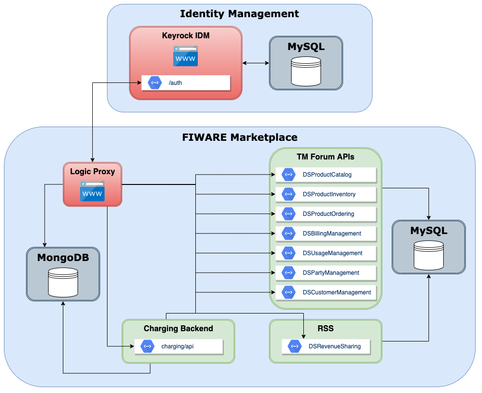

# kimarktplatz.arch-poc
Proof of concept of architecture for KI-Marktplatz

This repo provides Docker configurations and documentation for running
an instance of the FIWARE Marketplace.

## Overview

The proof of concept is based on the FIWARE marketplace (or Business API Ecosystem)
consisting of different components. Documentation on the marketplace and its components
can be found at the
[Documentation page](https://business-api-ecosystem.readthedocs.io/en/latest/) and
on [Github](https://github.com/FIWARE-TMForum/Business-API-Ecosystem).

The following picture shows the high-level architecture of the FIWARE Marketplace.

## Running

In the following different setups are shown for running an instance of the marketplace.

### Run single instance on local machine

Documentation and the required `docker-compose.yml` for running the FIWARE Marketplace
on a local machine for testing purpose can be found [here](./compose-local).

### Run single instance on FIWARE Lab Ubuntu VM

Documentation and the required `docker-compose.yml` files for running the FIWARE
Marketplace on a FIWARE Lab Ubuntu VM with public IP can be
found [here](./compose-lab-vm).
